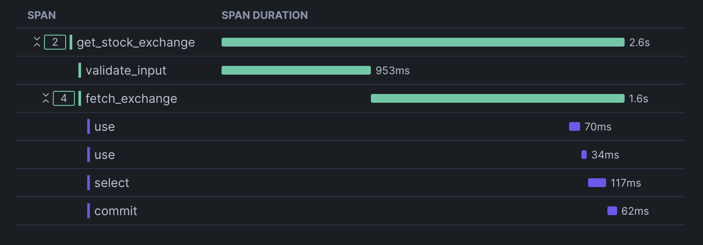

# Application Observability
Application observability involves instrumenting application code with metrics, traces, and logs. 
The sample code provided uses a simple service that can be deployed to Snowpark Container Services to illustrate how to implement instrumentation with OpenTelemetry in Snowflake.

## Stock Snap Service

### Overview
The Stock Snap Service is a simple web application written in Python, Go, and Java that offers stock price, top gainers, and stock exchange information via three APIs. 
The application is instrumented with OpenTelemetry. When deployed in Snowflake SPCS and its APIs are invoked, observability 
data is sent to a Snowflake-deployed OpenTelemetry Collector, which subsequently routes the data to the configured event table.

> **Note:** 
> The sample code provided uses a custom Snowflake TraceId Generator when generating traces, which is required for Snowflake to display traces and spans in the Snowsight UI.


#### APIs

- **Get Stock Price**: Retrieves the current price of a specified stock. Endpoint: `/stock?symbol=<stock_symbol>`
- **Get Top Gainers**: Retrieves a list of stocks with the highest gains. Endpoint: `/top-gainers`
- **Get Stock Exchange**: Retrieves the exchange a specified stock is listed on. Endpoint: `/stock-exchange?symbol=<stock_symbol>`

## Instrumentation
The application is instrumented with the following OpenTelemetry metrics and traces:

#### Metrics
- `request_count`: Counts the number of requests.
- `response_latency`: Measures the response latency in milliseconds.
- `stock_count`: Observes the number of stock entries.

#### Traces
- `get_stock_price`: Trace for the `get_stock_price` endpoint.
  - `validate_input`: Child span for input validation.
  - `fetch_price`: Child span for fetching the stock price.
- `get_top_gainers`: Trace for the `get_top_gainers` endpoint.
  - `fetch_prices`: Child span for fetching stock prices.
  - `sort_and_filter`: Child span for sorting and filtering top gainers.
- `get_stock_exchange`: Trace for the `get_stock_exchange` endpoint.
  - `validate_input`: Child span for input validation.
  - `fetch_exchange`: Child span for fetching the stock exchange.

### Building and Pushing Docker Container

To build the Docker container and push it to Snowflake SPCS for execution, follow these steps:

Change directory to `stock-snap-py`, `stock-snap-go`, or `stock-snap-java` based on the language you want to use.

Build the Docker image and upload it to your repository:
  ```bash
  bash build.sh <repository_url> <docker_tag> <snowflake_username>
  ```
Refer to the [Snowflake documentation](https://docs.snowflake.com/en/developer-guide/snowpark-container-services/tutorials/tutorial-1#build-an-image-and-upload) for detailed instructions on building and uploading the image.

### Creating the Service

Once the image is uploaded, you can create the service by following the instructions in the [Snowflake documentation](https://docs.snowflake.com/en/developer-guide/snowpark-container-services/tutorials/tutorial-1#create-a-service).

#### Kubernetes Specification

Use the following Service Specification to create the service:

```yaml
spec:
	containers:
	- name: stock-snap
	  image: <repository-url>/stock-snap-<py|go|java>:<tag>
	applicationMonitor:
	  metricConfig:
	    otlp:
	      endpoint: fromEnv
	  traceConfig:
	    otlp:
	      endpoint: fromEnv
	platformMonitor:
	  metricConfig:
		  groups:
			- system
	endpoints:
	- name: stock-snap-endpoint
	  port: 8080
	  public: true
```
The OpenTelemetry Collector endpoint will automatically be provided to the service containers via [opentelemetry environment variables](https://opentelemetry.io/docs/zero-code/net/configuration/#otlp) `OTEL_EXPORTER_OTLP_TRACES_ENDPOINT` and `OTEL_EXPORTER_OTLP_METRICS_ENDPOINT`.

Refer to the [Snowflake documentation](https://docs.snowflake.com/en/developer-guide/logging-tracing/event-table-setting-up) on how to access data in your Event Table.

### Interacting with the APIs

Once the service is up and running, you can interact with the APIs using your web browser.

#### Get Stock Price

Endpoint: `/stock`
```
http://<service_url>/stock?symbol=AAPL
```

#### Get Top Gainers

Endpoint: `/top-gainers`
```
http://<service_url>/top-gainers
```

#### Get Stock Exchange

Endpoint: `/stock-exchange`
```
http://<service_url>/stock-exchange?symbol=AAPL
```

To get your service ingress url, refer to the [Snowflake documentation](https://docs.snowflake.com/en/developer-guide/snowpark-container-services/tutorials/tutorial-1#use-the-service).

### Viewing Metrics and Traces

After executing the APIs a few times, you can view the metrics and traces in Snowflake.

#### Viewing Traces

Refer to the [Snowflake documentation](https://docs.snowflake.com/en/developer-guide/logging-tracing/tracing-accessing-events) for instructions on accessing trace events.

Sample SQL query to view trace data:
```sql
select timestamp, scope, start_timestamp, record:name as span_name, trace from <your-event-table>
where timestamp > dateadd(day, -1, current_timestamp())
and resource_attributes:"snow.service.name" = '<your-spcs-service-name>'
and record_type = 'SPAN'
order by timestamp
```

> **Note:** Trace propagation is supported for the Python example. Services that interact with a Snowflake table via the Python connector will have those SQL queries properly nested within the parent span. The Java and Go connectors are WIP.

To visualize the trace tree, navigate to **Monitoring > Traces & Logs** in the Snowsight sidebar, and select a Trace. An example trace tree visualization for the `get_stock_exchange` function is shown below (trace propagation enables the SQL queries to be nested under `fetch_exchange` parent span):



#### Viewing Metric Data

Refer to the [Snowflake documentation](https://docs.snowflake.com/en/developer-guide/logging-tracing/metrics-viewing-data) for instructions on viewing metric data.

Sample SQL query to view metric data:
```sql
select timestamp, scope, record:metric.name AS metric_name, value, record_attributes from <your-event-table>
where timestamp > dateadd(day, -1, current_timestamp())
and resource_attributes:"snow.service.name" = '<your-spcs-service-name>'
and record_type = 'METRIC'
and scope:name  != 'snow.spcs.platform'
order by timestamp
```

#### Viewing Log Data

Refer to the [Snowflake documentation](https://docs.snowflake.com/en/developer-guide/logging-tracing/logging-accessing-messages) for instructions on viewing log data.

Sample SQL query to view log data:
```sql
select timestamp, record:severity_text, value as message from <your-event-table>
where timestamp > dateadd(day, -1, current_timestamp())
and resource_attributes:"snow.service.name" = '<your-spcs-service-name>'
and resource_attributes:"snow.service.container.name" = '<your-spcs-container-name>'
and record_type = 'LOG'
order by timestamp
```
