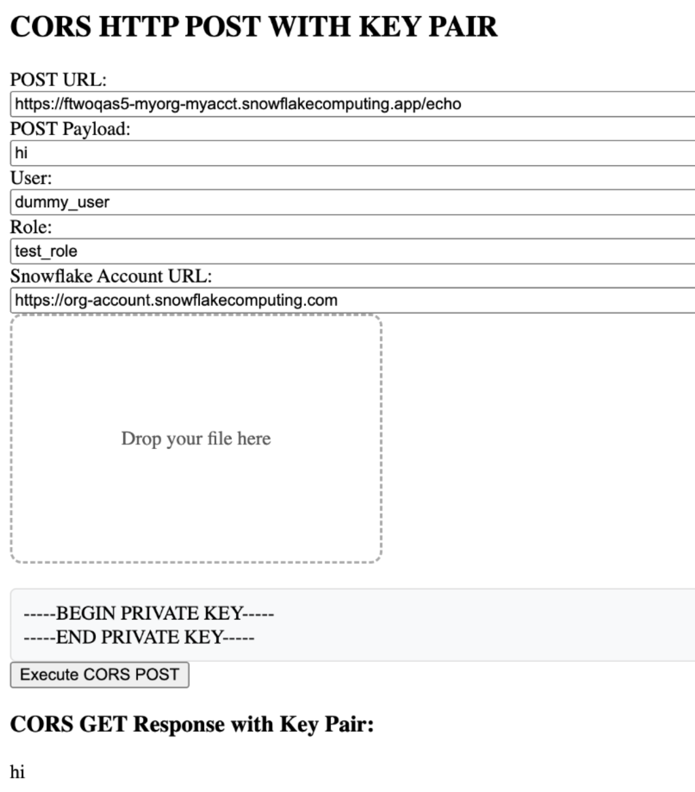

# Introduction
After completing the [common setup](https://docs.snowflake.com/en/developer-guide/snowpark-container-services/tutorials/common-setup), you are ready to create a service. In this tutorial, you will create one service (named echo_service_with_cors) that exposes an endpoint to respond to CORS requests. Then you will create a service locally to send CORS requests to the endpoint: 

**1. /healthcheck:** this method should respond with "I'm ready!"

**2. /echo:** this method should echo back the message that is sent in the request body.

<br>

At a high-level, this tutorial contains the following steps:

1. Download the service code for this tutorial.

2. Build a Docker image for Snowpark Container Services, and upload the image to a repository in your account.

3. Create the service by providing the service specification file and the compute pool in which to run the service.

6. Configure key pair authentication and/or PAT token authentication

7. Send CORS requests from localhost 

<br>

# 1: Download the service code
1. Code (a Python application) is provided to create the CORS services.

2. Download the code from this repo under /cors_app.

<br>

# 2: Build an image and upload
Build an image for the linux/amd64 platform that Snowpark Container Services supports, and then upload the image to the image repository in your account (see Common Setup).

You will need information about the repository (the repository URL and the registry hostname) before you can build and upload the image. For more information, see Registry and Repositories.

**Get information about the repository**

1. To get the repository URL, execute the SHOW IMAGE REPOSITORIES SQL command.
```
SHOW IMAGE REPOSITORIES;
```
The repository_url column in the output provides the URL. An example is shown:
```
<orgname>-<acctname>.registry.snowflakecomputing.com/tutorial_db/data_schema/tutorial_repository
```
The host name in the repository URL is the registry host name. An example is shown:
```
<orgname>-<acctname>.registry.snowflakecomputing.com
```

**Build image and upload it to the repository**

1. Open a terminal window, and change to the directory /cors_app.

2. To build a Docker image, execute the following docker build command using the Docker CLI. Note the command specifies current working directory (.) as the PATH for files to use for building the image.
```
docker build --rm --platform linux/amd64 -t <repository_url>/<image_name> .
```
For image_name, use cors_image:latest.
**Example**
```
docker build --rm --platform linux/amd64 -t myorg-myacct.registry.snowflakecomputing.com/tutorial_db/data_schema/tutorial_repository/cors_image:latest .
```
3. Upload the image to the repository in your Snowflake account. In order for Docker to upload an image on your behalf to your repository, you must first authenticate Docker with the registry.

To authenticate Docker with the image registry, execute the following command.
```
docker login <registry_hostname> -u <username>
```
For username, specify your Snowflake username. Docker will prompt you for your password.

To upload the image execute the following command:
```
docker push <repository_url>/<image_name>
```
**Example**
```
docker push myorg-myacct.registry.snowflakecomputing.com/tutorial_db/data_schema/tutorial_repository/cors_image:latest
```

<br>

# 3: Create the service
In this section you create a service and also create a service function to communicate with the service.

To create a service, you need the following:

A [compute pool](https://docs.snowflake.com/en/developer-guide/snowpark-container-services/working-with-compute-pool). Snowflake runs your service in the specified compute pool. You created a compute pool as part of the common setup.

A [service specification](https://docs.snowflake.com/en/developer-guide/snowpark-container-services/specification-reference). This specification provides Snowflake with the information needed to configure and run your service. For more information, see [Snowpark Container Services: Working with services](https://docs.snowflake.com/en/developer-guide/snowpark-container-services/working-with-services). In this tutorial, you provide the specification inline, in CREATE SERVICE command. You can also save the specification to a file in your Snowflake stage and provide file information in the CREATE SERVICE command as shown in Tutorial 2.

A service function is one of the methods available to communicate with your service. A service function is a user-defined function (UDF) that you associate with the service endpoint. When the service function is executed, it sends a request to the service endpoint and receives a response.

1. Verify that the compute pool is ready and that you are in the right context to create the service.

  a. Previously you set the context in the [Common Setup](https://docs.snowflake.com/en/developer-guide/snowpark-container-services/tutorials/common-setup.html#label-snowpark-containers-common-setup-create-objects) step. To ensure you are in the right context for the SQL statements in this step, execute the following:
  ```
  USE ROLE test_role;
  USE DATABASE tutorial_db;
  USE SCHEMA data_schema;
  USE WAREHOUSE tutorial_warehouse;
  ```
  b. To ensure the compute pool you created in the common setup is ready, execute DESCRIBE COMPUTE POOL, and verify that the state is ACTIVE or IDLE. If the state is STARTING, you need to wait until the state changes to either ACTIVE or IDLE.
  ```
  DESCRIBE COMPUTE POOL tutorial_compute_pool;
  ```

2. To create the echo_service_with_cors service with corsSettings that allows localhost, execute the following command using test_role:
```
USE ROLE test_role;
CREATE SERVICE echo_service_with_cors
  IN COMPUTE POOL tutorial_compute_pool
  EXTERNAL_ACCESS_INTEGRATIONS = (allow_cors_requester_integration)
  FROM SPECIFICATION $$
    spec:
      containers:
      - name: echo
        image: /tutorial_db/data_schema/tutorial_repository/cors_image:latest
        env:
          SERVER_PORT: 8000
          CHARACTER_NAME: Bob
        readinessProbe:
          port: 8000
          path: /healthcheck
      endpoints:
      - name: echoendpoint
        port: 8000
        public: true
        corsSettings:
          Access-Control-Allow-Origin:
          - http://localhost:8888
          Access-Control-Allow-Methods:
          - POST
          Access-Control-Allow-Headers:
          - Authorization
          - Content-Type
          - Origin
          - Vary
          - Custom-Header-A
          Access-Control-Expose-Headers:
          - Custom-Header-X
      $$
   MIN_INSTANCES=1
   MAX_INSTANCES=1;
```
<pre>
<b>Note</b>
If a service with that name already exists, use the DROP SERVICE command to delete the previously created service, and then create this service.
</pre>


3. Execute the following SQL commands to get detailed information about the service you just created. For more information, see Snowpark Container Services: Working with services.

To list services in your account, execute the SHOW SERVICES command:
```
SHOW SERVICES;
```
To get information about your service including the service status, execute the DESCRIBE SERVICE command.
```
DESC SERVICE echo_service_with_cors;
```
Verify the status column shows the service status as RUNNING; if the status is PENDING, it indicates the service is still starting. To investigate why the service is not RUNNING, execute the SHOW SERVICE CONTAINERS IN SERVICE command and review the status of individual containers:
```
SHOW SERVICE CONTAINERS IN SERVICE echo_service_with_cors;
```
Verify that you can access the endpoint by hitting the endpoint in the browser:
**Example**
```
https://ftwoqas5-myorg-myacct.snowflakecomputing.app/healthcheck
```

# 4: Configure key pair authentication
 1. Configure key pair authentication for the user by following the [key pair authentication guide](https://docs.snowflake.com/en/user-guide/key-pair-auth)

 2. Configure a PAT token for the user by following the [PAT token guide](https://docs.snowflake.com/LIMITEDACCESS/programmatic-access-tokens)


# 5: Spin up the service locally
In the cors_app folder, using a Python virtual environment, execute:
```
python3 -m venv .  
source bin/activate 
pip3 install --upgrade pip
pip3 install -r requirements.txt
python3 echo_service.py
```

Access the endpoint at http://localhost:8888/ui in a web browser. This causes the service to execute the ui() function (see echo_service.py).


# 6: Send CORS requests to the endpoint on local browser

There are 4 functionalities the endpoint provides:

  a. Making a GET request with info necessary for programmatic access using key pair authentication

  b. Making a GET request with info necessary for programmatic access using a PAT token

  c. Making a POST request with info necessary for programmatic access using key pair authentication

  d. Making a POST request with info necessary for programmatic access using a PAT token

Input the endpoint, user, role, and account URL. The JWT token retrival part (a and c) / PAT token exchange (b and d) will be done automatically. For more information on how to find the account URL, visit [Account identifiers](https://docs.snowflake.com/en/user-guide/admin-account-identifier). The value of Role is automatically capitalized as Snowflake roles are always in uppercase.
Note that comparing to the [programmatic access tutorial](https://docs.snowflake.com/en/developer-guide/snowpark-container-services/tutorials/tutorial-1#setup), the account and endpoint are both omitted as input, since they can be deduced from the Snowflake Account URL and the GET / POST URL respectively.
Also note that all 4 functionalities validate Access-Control-Allow-Headers and Access-Control-Expose-Headers as an example. 

For a:


<br>
For b:


<br>
For c:



<br>
For d:


