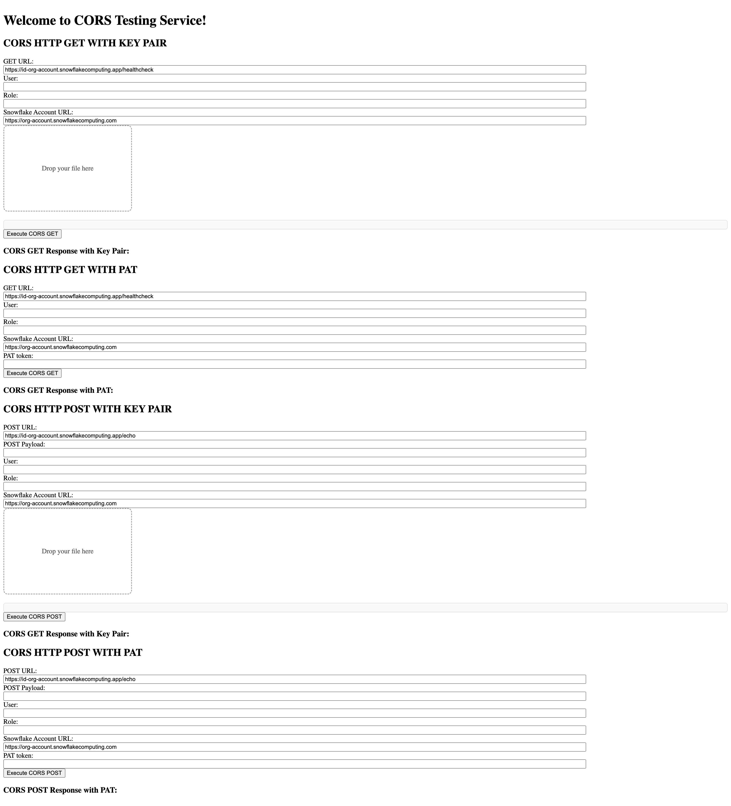

# Introduction
After completing the [common setup](https://docs.snowflake.com/en/developer-guide/snowpark-container-services/tutorials/common-setup), you are ready to create a service. In this tutorial, you create two identitcal services where one service (named echo_service_cors_requester) sends CORS requests to the other (named echo_service_cors_responder). There are two types of requests that echo_service_cors_requester can send to echo_service_cors_responder: 

**1. /healthcheck:** this method should respond with "I'm ready!"

**2. /echo:** this method should echo back the message that is sent in the request body.

<br>

At a high-level, this tutorial contains the following steps:

1. Download the service code for this tutorial.

2. Build a Docker image for Snowpark Container Services, and upload the image to a repository in your account.

3. Create services by providing the service specification file and the compute pool in which to run the service.

4. Create necessary network rules and External Access Integrations for endpoint to endpoint communication.

5. Create necessary network policies for programmatic access

6. Configure key pair authentication

7. Use one endpoint to talk to the other.  


# 1: Download the service code
1. Code (a Python application) is provided to create the CORS services.

2. Download the code from this repo under /cors_app.

# 2: Build an image and upload
Build an image for the linux/amd64 platform that Snowpark Container Services supports, and then upload the image to the image repository in your account (see Common Setup).

You will need information about the repository (the repository URL and the registry hostname) before you can build and upload the image. For more information, see Registry and Repositories.

**Get information about the repository**

1. To get the repository URL, execute the SHOW IMAGE REPOSITORIES SQL command.
```
SHOW IMAGE REPOSITORIES;
```
The repository_url column in the output provides the URL. An example is shown:
```
<orgname>-<acctname>.registry.snowflakecomputing.com/tutorial_db/data_schema/tutorial_repository
```
The host name in the repository URL is the registry host name. An example is shown:
```
<orgname>-<acctname>.registry.snowflakecomputing.com
```

**Build image and upload it to the repository**

1. Open a terminal window, and change to the directory /cors_app.

2. To build a Docker image, execute the following docker build command using the Docker CLI. Note the command specifies current working directory (.) as the PATH for files to use for building the image.
```
docker build --rm --platform linux/amd64 -t <repository_url>/<image_name> .
```
For image_name, use cors_image:latest.
**Example**
```
docker build --rm --platform linux/amd64 -t myorg-myacct.registry.snowflakecomputing.com/tutorial_db/data_schema/tutorial_repository/cors_image:latest .
```
3. Upload the image to the repository in your Snowflake account. In order for Docker to upload an image on your behalf to your repository, you must first authenticate Docker with the registry.

To authenticate Docker with the image registry, execute the following command.
```
docker login <registry_hostname> -u <username>
```
For username, specify your Snowflake username. Docker will prompt you for your password.

To upload the image execute the following command:
```
docker push <repository_url>/<image_name>
```
**Example**
```
docker push myorg-myacct.registry.snowflakecomputing.com/tutorial_db/data_schema/tutorial_repository/cors_image:latest
```

# 3: Create services
In this section you create a service and also create a service function to communicate with the service.

To create a service, you need the following:

A [compute pool](https://docs.snowflake.com/en/developer-guide/snowpark-container-services/working-with-compute-pool). Snowflake runs your service in the specified compute pool. You created a compute pool as part of the common setup.

A [service specification](https://docs.snowflake.com/en/developer-guide/snowpark-container-services/specification-reference). This specification provides Snowflake with the information needed to configure and run your service. For more information, see [Snowpark Container Services: Working with services](https://docs.snowflake.com/en/developer-guide/snowpark-container-services/working-with-services). In this tutorial, you provide the specification inline, in CREATE SERVICE command. You can also save the specification to a file in your Snowflake stage and provide file information in the CREATE SERVICE command as shown in Tutorial 2.

A service function is one of the methods available to communicate with your service. A service function is a user-defined function (UDF) that you associate with the service endpoint. When the service function is executed, it sends a request to the service endpoint and receives a response.

1. Verify that the compute pool is ready and that you are in the right context to create the service.

  a. Previously you set the context in the [Common Setup](https://docs.snowflake.com/en/developer-guide/snowpark-container-services/tutorials/common-setup.html#label-snowpark-containers-common-setup-create-objects) step. To ensure you are in the right context for the SQL statements in this step, execute the following:
  ```
  USE ROLE test_role;
  USE DATABASE tutorial_db;
  USE SCHEMA data_schema;
  USE WAREHOUSE tutorial_warehouse;
  ```
  b. To ensure the compute pool you created in the common setup is ready, execute DESCRIBE COMPUTE POOL, and verify that the state is ACTIVE or IDLE. If the state is STARTING, you need to wait until the state changes to either ACTIVE or IDLE.
  ```
  DESCRIBE COMPUTE POOL tutorial_compute_pool;
  ```
2. To create the echo_service_cors_requester service, execute the following command using test_role:
```
CREATE SERVICE echo_service_cors_requester
  IN COMPUTE POOL tutorial_compute_pool
  FROM SPECIFICATION $$
    spec:
      containers:
      - name: echo
        image: /tutorial_db/data_schema/tutorial_repository/cors_image:latest
        env:
          SERVER_PORT: 8000
          CHARACTER_NAME: Bob
        readinessProbe:
          port: 8000
          path: /healthcheck
      endpoints:
      - name: echoendpoint
        port: 8000
        public: true
      $$
   MIN_INSTANCES=1
   MAX_INSTANCES=1;
```
<pre>
<b>Note</b>
If a service with that name already exists, use the DROP SERVICE command to delete the previously created service, and then create this service.
</pre>

3. Execute the following SQL commands to get detailed information about the service you just created. For more information, see Snowpark Container Services: Working with services.

To list services in your account, execute the SHOW SERVICES command:
```
SHOW SERVICES;
```
To get information about your service including the service status, execute the DESCRIBE SERVICE command.
```
DESC SERVICE echo_service_cors_requester;
```
Verify the status column shows the service status as RUNNING; if the status is PENDING, it indicates the service is still starting. To investigate why the service is not RUNNING, execute the SHOW SERVICE CONTAINERS IN SERVICE command and review the status of individual containers:
```
SHOW SERVICE CONTAINERS IN SERVICE echo_service_cors_requester;
```
4. Find the endpoint of the echo_service_cors_requester service:
Find the URL of the public endpoint the service exposes:
```
SHOW ENDPOINTS IN SERVICE echo_service_cors_requester;
```
The ingress_url column in the response provides the URL.
**Example**
```
btwoqas5-myorg-myacct.snowflakecomputing.app
```

5. Create the “echo_service_cors_responder” service with corsSettings that allows the echo_service_cors_requester service's endpoint:
```
USE ROLE test_role;
CREATE SERVICE echo_service_cors_responder
  IN COMPUTE POOL tutorial_compute_pool
  EXTERNAL_ACCESS_INTEGRATIONS = (allow_cors_requester_integration)
  FROM SPECIFICATION $$
    spec:
      containers:
      - name: echo
        image: /tutorial_db/data_schema/tutorial_repository/cors_image:latest
        env:
          SERVER_PORT: 8000
          CHARACTER_NAME: Bob
        readinessProbe:
          port: 8000
          path: /healthcheck
      endpoints:
      - name: echoendpoint
        port: 8000
        public: true
        corsSettings:
          Access-Control-Allow-Origin:
          - https://btwoqas5-myorg-myacct.snowflakecomputing.app
          - http://127.0.0.1:8888
          Access-Control-Allow-Headers:
          - Authorization
          - Content-Type
          - Origin
          - Vary
      $$
   MIN_INSTANCES=1
   MAX_INSTANCES=1;
```

# 4: Create network rules and EAI
1. Find the endpoint of the echo_service_cors_responder service:
Find the URL of the public endpoint the service exposes:
```
SHOW ENDPOINTS IN SERVICE echo_service_cors_responder;
```
The ingress_url column in the response provides the URL.
**Example**
```
ftwoqas5-myorg-myacct.snowflakecomputing.app
```

2. Verify that you can access the endpoint by hitting the endpoint in the browser:
**Example**
```
https://ftwoqas5-myorg-myacct.snowflakecomputing.app/ui
```

3. Find the snowflake account URL:


<br>

4. Create network rules and EAI (External Access Integration) for the echo_service_cors_requester service:
```
USE ROLE ACCOUNTADMIN;
CREATE OR REPLACE NETWORK RULE tutorial_db.public.token_rule
  MODE = EGRESS
  TYPE = HOST_PORT
  VALUE_LIST = ('<snowflake_account_hostname>');
CREATE OR REPLACE NETWORK RULE tutorial_db.public.cors_responder_rule
  MODE = EGRESS
  TYPE = HOST_PORT
  VALUE_LIST = ('ftwoqas5-myorg-myacct.snowflakecomputing.app');
CREATE EXTERNAL ACCESS INTEGRATION allow_cors_responder_integration
  ALLOWED_NETWORK_RULES = (tutorial_db.public.cors_responder_rule, tutorial_db.public.token_rule)
  ENABLED = true;
grant usage on integration allow_cors_responder_integration to role test_role;
```

5.  ALTER the echo_service_cors_requester with the EAI:
```
USE ROLE test_role;
ALTER SERVICE echo_service_cors_requester set EXTERNAL_ACCESS_INTEGRATIONS = (allow_cors_responder_integration)
```

Note that the ALTER can take 10 - 15 min to take effect. Meanwhile, do not access the endpoint to avoid caching incorrect network rules.

# 5: Create necessary network policies
If there's network policies set on the account, we will have to set up [network policy](https://docs.snowflake.com/en/user-guide/network-policies) for at least the user. This steps unblocks inbound access to the customer's Snowflake account, which is needed for the token exchange step in programmatic access. By default, this step requires the ACCOUNTADMIN or SECURITYADMIN role. 
<br>
Note down the current network policy on the account:
**Example**
```
show network policies;
```

Create a network rule with all the IPs. To get a JWT token locally and supply to the service or to run the service locally with built-in programmaitc access support, the IP of the laptop needs to be specified. If testing with the echo_service_cors_requester service we have set up, the IPs of the Snowflake proxies need to be specified. IPs of the Snowflake proxies can be found on https://whatismyipaddress.com/hostname-ip or other sites with similar functionality. To specify IPs that are allowed to send traffic into the customer's Snowflake account, run the following query in the Snowflake account with a role with access:
**Example**
```
CREATE OR REPLACE NETWORK RULE cors_supply_jwt_account_ingress
  MODE = INGRESS
  TYPE = IPV4
  VALUE_LIST = ('...');
```

Create a network policy with all the new network rule as well as any existing rules on the account:
**Example**
```
CREATE OR REPLACE NETWORK POLICY allow_cors_policy
  ALLOWED_NETWORK_RULE_LIST = (cors_supply_jwt_account_ingress, existing_network_rule_on_account);
```

Set the user's network policy to the newly created network policy:
**Example**
```
ALTER USER YIZHANG SET NETWORK_POLICY = allow_cors_policy;
```

Note that allowing the Snowflake proxies allows access from all traffic from within SPCS from all accounts. In addition, the IPs can change whenever there's a restart of Snowflake proxies. If the /jwt request fails, repeat this step. We recognize that this is not ideal. We are working on a Snowflake system function that would make such network rules unnecessary. 

# 6: Configure key pair authentication
 Configure key pair authentication for the user by following the first two steps in [Setup in the programmatic access tutorial](https://docs.snowflake.com/en/developer-guide/snowpark-container-services/tutorials/tutorial-1#setup).


# 7: Use one endpoint to talk to the other
The service exposes the endpoint publicly (see the inline specification provided in the CREATE SERVICE command). Therefore, you can log in to a web UI the service exposes to the internet, and then send requests to the service from a web browser.

1. Find the URL of the public endpoint the service exposes:

```
SHOW ENDPOINTS IN SERVICE echo_service_cors_requester;
```
The ingress_url column in the response provides the URL.

**Example**
```
btwoqas5-myorg-myacct.snowflakecomputing.app
```

2. Append /ui to the endpoint URL, and paste it in the web browser. This causes the service to execute the ui() function (see echo_service.py).

Note that the first time you access the endpoint URL, you will be asked to log in to Snowflake. For this test, use the same user that you used to create the service to ensure the user has the necessary privileges.



<br> There are 4 functionalities the endpoint provides:

  a. Making a GET request with a JWT token provided

  b. Making a GET request with info necessary for programmatic access

  c. Making a POST request with a JWT token provided

  d. Making a POST request with info necessary for programmatic access

## For testing a and c:

3. Get a JWT token by following the rest of the [programmatic access tutorial](https://docs.snowflake.com/en/developer-guide/snowpark-container-services/tutorials/tutorial-1#optional-access-the-public-endpoint-programmatically). 
The JWT token is in commandline output following:

```
INFO:__main__:snowflake jwt : 
```

4. Input the ingress url of echo_service_cors_responder in GET URL and JWT token. You should see


## For testing b and d:

3. If testing a and c is successful, we could optionally test b and d locally first. After installing necessary packages, spin up the server by running:

```
python3 echo_service.py
```

4. Input the same info in b and d as in programmatic access. The JWT token retrival part will be done automatically. The token will also be printed out to the browser console for further testing.


<br> Note that in the web UI, the value of Role is automatically capitalized as Snowflake roles are always in uppercase.
Note that the account and endpoint are both omitted as input, since they can be deduced from the Snowflake Account URL and the GET / POST URL respectively.

5. Input the same information on echo_service_cors_requester's website. Use the /echo path in the POST URL. You should see the following:


